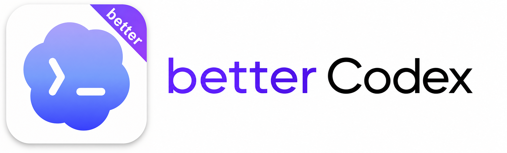
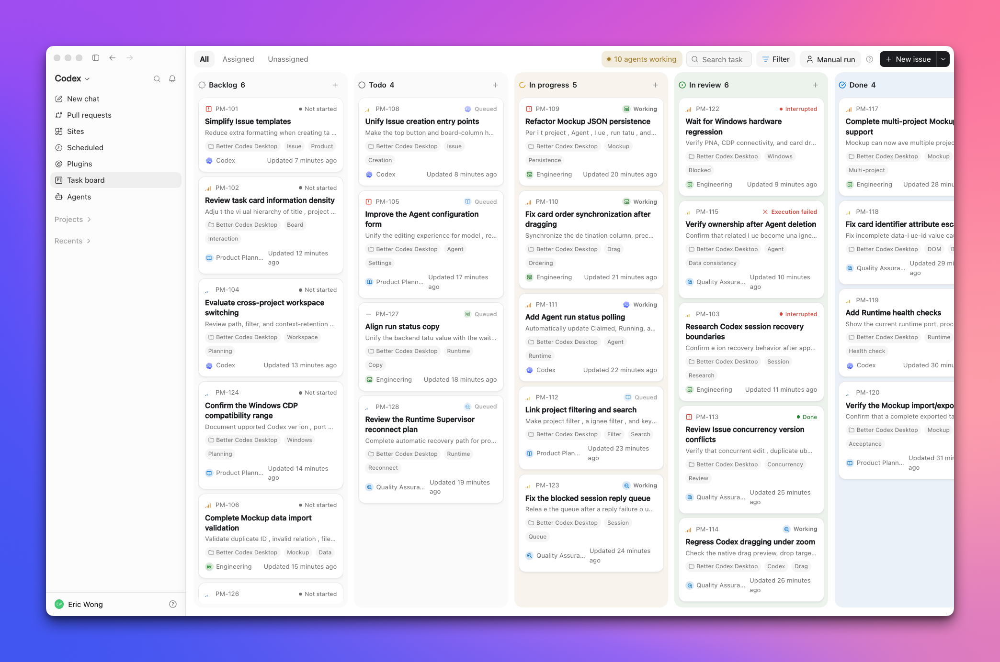
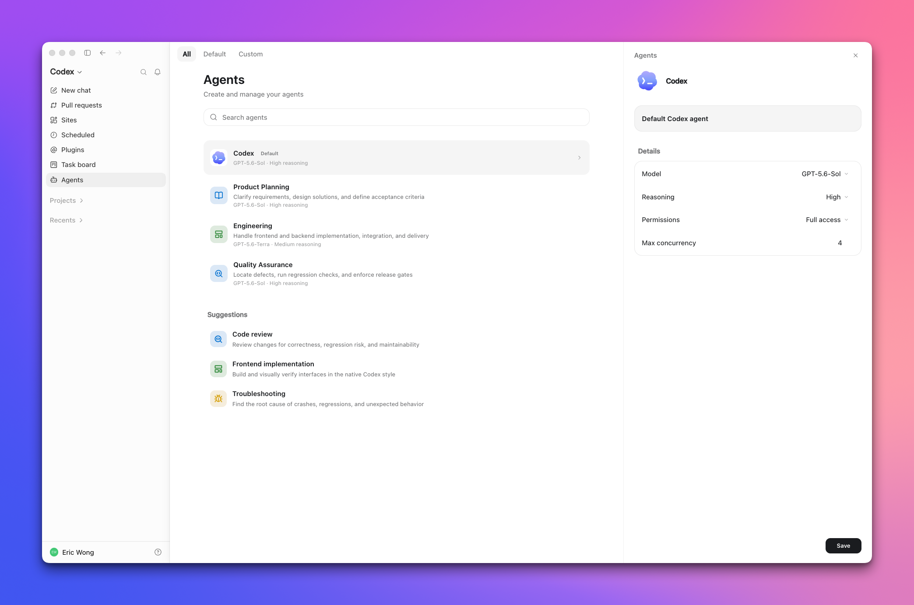

<p align="center">
  
</p>

<p align="center">
  <strong>From start to finish, keep your work in Codex clear and visible.</strong>
</p>

<p align="center">
  A native task board and multi-Agent collaboration system that runs inside the Codex app. Local-first, one-command install.
</p>

<p align="center">
  <a href="https://github.com/Ericwong5021/better-codex/releases/latest"></a>
  <a href="https://github.com/Ericwong5021/better-codex/stargazers"></a>
  <a href="https://github.com/Ericwong5021/better-codex/releases"></a>
  <a href="https://github.com/Ericwong5021/better-codex/actions/workflows/ci.yml"></a>
  
  
</p>

<p align="center">
  <a href="README.md">简体中文</a> · English
</p>

<p align="center">
  
</p>

## Why this exists

If you use Codex heavily, some of this probably sounds familiar:

- **Your session list is a graveyard.**<br>
  Dozens (hundreds?) of conversations, all titled roughly the same, none of them grouped by what you were actually working on. Finding "that thread where we debugged the auth flow" means scrolling and guessing.

- **One model config rules everything.**<br>
  You bump the reasoning level for a hard refactor, and now every new session pays for it. You tune the model for quick Q&A, and your next deep debugging session starts underpowered. There's one global dial, and every task fights over it.

- **Ideas have nowhere to live.**<br>
  Mid-conversation, you think of three more things worth doing. Codex gives you no place to put them, so they end up in a notes app, a TODO comment, or nowhere. The work you *meant* to do quietly evaporates.

- **Codex is conversation-shaped, but your work isn't.**<br>
  Real work is a project that spans days and many threads. Codex hands you a chat log and wishes you luck.

None of this is the model's fault. The model is great. What's missing is a **work layer** on top of it. So we built a better Codex, literally Better Codex.

## What you get

**Find any conversation again.**<br>
Turn conversations into tasks and organize them by project, status, and owner. Open a task to return to its linked conversation.

**Capture ideas before they disappear.**<br>
Add new tasks as they come up, then get back to your current work.

**See task progress at a glance.**<br>
Assign work to yourself or an Agent, then run it manually or automatically. Tasks return to your board when they need review, a decision, or unblocking.

**Configure each Agent separately.**<br>
Set the model, reasoning level, permissions, instructions, and concurrency limit for each role.

<p align="center">
  
</p>

## Who it's for

Better Codex works across many roles. If your work spans several Codex conversations and needs progress tracking, review, or repeated revisions, it can fit the same task workflow.

- **Developers.** Manage requirements, bugs, refactors, and release checks by project. Each task can stay linked to its original conversation, with progress, results, and pending reviews collected on the board.
- **Solo companies.** Keep product ideas, customer feedback, operations, and content plans on one board. Give research, drafting, and checking to different Agents while keeping final decisions with you.
- **Content creators.** Save ideas in the backlog, then organize research, outlines, drafts, and revisions as tasks. Each piece can stay linked to its original conversation, so you know where to continue when you come back later.
- **Product managers.** Manage requirements, user feedback, competitor research, bugs, and release checks separately. Linked conversations preserve the discussion, while the board shows the next step and current owner.
- **Sales professionals.** Organize public account research, meeting preparation, proposal drafts, and follow-up tasks. Create a project for each account or opportunity instead of scattering research and next steps across conversations.
- **Office staff.** Track meeting notes, announcement drafts, report preparation, spreadsheet work, and recurring administrative tasks. Give each Codex-assisted task to an Agent, then review the results in one place.

## A day with Better Codex

1. Open `Task board` from the Codex sidebar to manage work, or `Agents` to configure Agent profiles.
2. Create a project and capture a task, manually or straight from the conversation you're in.
3. Assign it to yourself, the default Codex profile, or one of your Agent profiles.
4. Keep manual mode for full control, or enable automatic mode and let ready Agent-owned tasks run.
5. Watch the board. When a task needs review or a decision, it comes back to you.
6. Open the task to read its linked conversation, send a reply, or continue in Codex.

The same loop works for coding, research, writing, document prep, and anything you already do in Codex.

## Installation

macOS:

```bash
curl -fsSL https://raw.githubusercontent.com/Ericwong5021/better-codex/main/scripts/install.sh | bash
```

Windows (PowerShell):

```powershell
irm https://raw.githubusercontent.com/Ericwong5021/better-codex/main/scripts/install.ps1 | iex
```

Better Codex runs as a small Node.js bundle and requires Node.js 22.5 or later. The installer checks this before changing an existing installation. If Node.js is missing or too old, it asks before installing the current LTS release; declining leaves the existing Better Codex installation and database untouched.

The installer adds the CLI, Skill, local runtime, and system launcher, then registers the `better-codex` MCP server with Codex. The MCP server runs only on your computer and provides the Better Codex app entry and route. Projects, tasks, and conversation data remain in the local database. Legacy standalone-EXE installations are removed only after the Node.js bundle passes version and health checks.

Restart Codex from the Better Codex launcher, and `Task board` and `Agents` appear as two entries in your sidebar. Run `better-codex uninstall` to remove Better Codex completely.

## FAQ

**Is this an official OpenAI product?**<br>
No. Better Codex is an independent open-source project built on top of Codex Desktop. It is not affiliated with or endorsed by OpenAI.

**Where does my data go?**<br>
Nowhere. Projects, tasks, assignments, and run state live in a local SQLite database (`~/.better-codex/better-codex.db` on macOS, `%USERPROFILE%\.better-codex\better-codex.db` on Windows). The runtime listens on `127.0.0.1` only. There is no Better Codex cloud service and no account.

**Why does Better Codex register an MCP server?**<br>
Codex uses the local MCP app to recognize the Better Codex app entry and route. This puts the task board into the Codex navigation flow instead of placing it over the last conversation route. The MCP server runs locally over stdio. It is not a cloud service and does not upload task data.

**Will it break my Codex?**<br>
The app entry and route are registered through the local MCP server. The page integration uses the desktop app's local CDP interface and page structure. It doesn't patch Codex binaries. A Codex update can occasionally require a matching Better Codex compatibility update; when that happens, an update notice appears inside Codex. If anything looks off, run `better-codex doctor`.

**How do I disable or uninstall it?**<br>
`better-codex eject` disables the page integration but keeps your task data and installed components. `better-codex uninstall` removes the MCP server, background service, launcher, Skill, Agent profiles, local data, and CLI bundle.

**How do updates work?**<br>
Better Codex checks a signed update manifest in the background and shows a notice inside Codex when a new version is available. You can also rerun the install command at any time. It upgrades in place when possible.

**Which platforms are supported?**<br>
Codex Desktop on macOS (Apple Silicon and Intel) and the Microsoft Store version of Codex on Windows x64. Release packages and CI cover all three.

## Useful commands

```bash
better-codex doctor            # check MCP, runtime, database, Codex compatibility, injection state
better-codex status            # show the current service and board connection
better-codex mcp status        # inspect the MCP registration
better-codex mcp install       # register or repair the MCP server
better-codex launcher install  # install the system launcher
better-codex launcher status   # inspect the system launcher
better-codex eject             # remove the sidebar integration, keep task data
better-codex uninstall         # uninstall completely and delete local data
```

## Install from source

Requires Node.js 22.5 or later.

If the stable build is already installed, install the source checkout as a separate development instance. Stable keeps `~/.better-codex` and the `Better Codex` launcher; development uses `~/.better-codex-dev` and `Better Codex Dev`. Both profiles use the stable database at `~/.better-codex/better-codex.db` by default, while their runtime files, logs, attachments, and update state stay isolated. Opening either launcher deactivates the other instance's page injection first.

```bash
git clone https://github.com/Ericwong5021/better-codex.git
cd better-codex
npm ci
npm run dev:install
```

The development instance does not auto-update its core. Pull source changes and run `npm run build` to refresh it. Use `npm run dev:status` to inspect the development instance and `npm run dev:uninstall` to remove its launcher and stop it while preserving development data.

## Community

- Found a bug or want a feature? Open a [GitHub Issue](https://github.com/Ericwong5021/better-codex/issues).
- Questions and workflow ideas belong in [GitHub Discussions](https://github.com/Ericwong5021/better-codex/discussions).
- Want to help test Beta releases? Read the [Beta testing guide](CONTRIBUTING.md#beta-testing).
- Please use English in public GitHub conversations so everyone can follow them.

If Better Codex makes your Codex better, a star helps other heavy users find it.
