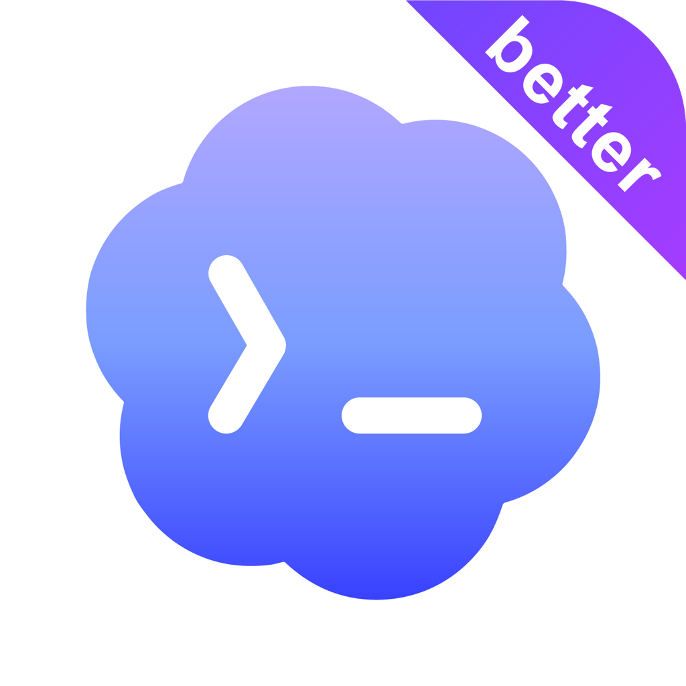
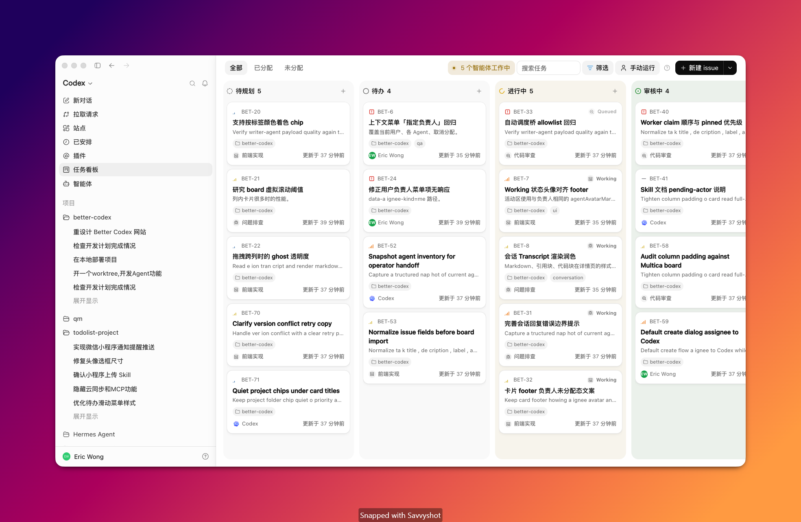
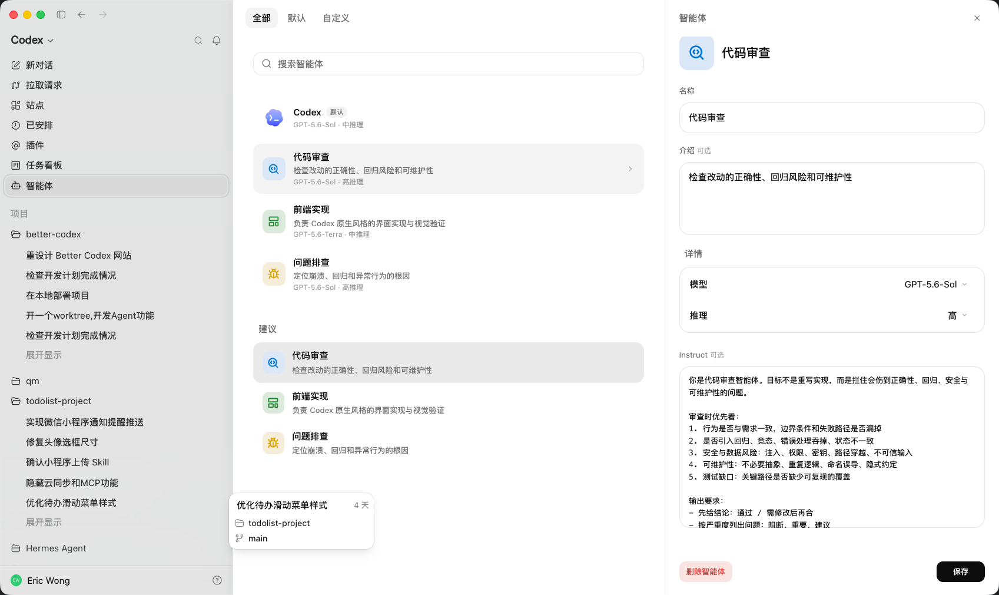

<p align="center">
  
</p>

<h1 align="center">Better Codex</h1>

<p align="center">
  <strong>From start to finish, keep your work in Codex clear and visible.</strong>
</p>

<p align="center">
  A task board and Agent system that live inside Codex Desktop. Local-first, one-command install.
</p>

<p align="center">
  <a href="https://github.com/Ericwong5021/better-codex/releases/latest"></a>
  <a href="https://github.com/Ericwong5021/better-codex/stargazers"></a>
  <a href="https://github.com/Ericwong5021/better-codex/releases"></a>
  <a href="https://github.com/Ericwong5021/better-codex/actions/workflows/ci.yml"></a>
  
  
</p>

<p align="center">
  English · <a href="README.zh-CN.md">简体中文</a>
</p>

<p align="center">
  
</p>

## Why this exists

If you use Codex heavily, some of this probably sounds familiar:

- **Your session list is a graveyard.** Dozens (hundreds?) of conversations, all titled roughly the same, none of them grouped by what you were actually working on. Finding "that thread where we debugged the auth flow" means scrolling and guessing.
- **One model config rules everything.** You bump the reasoning level for a hard refactor, and now every new session pays for it. You tune the model for quick Q&A, and your next deep debugging session starts underpowered. There's one global dial, and every task fights over it.
- **Ideas have nowhere to live.** Mid-conversation, you think of three more things worth doing. Codex gives you no place to put them, so they end up in a notes app, a TODO comment, or nowhere. The work you *meant* to do quietly evaporates.
- **Codex is conversation-shaped, but your work isn't.** Real work is a project that spans days and many threads. Codex hands you a chat log and wishes you luck.

None of this is the model's fault. The model is great. What's missing is a **work layer** on top of it. So we built a better Codex, literally Better Codex.

## What you get

Better Codex extends the native Codex Desktop app. Everything lives *inside* Codex, with the same window, same look, and near-native feel. No separate web dashboard, no account, no data leaving your machine.

**Lost sessions → tasks linked to conversations.** Capture any conversation as a task on a board, organized by project, status, priority, label, and owner. When you come back three days later, you don't scroll through chat history. You open the task and land in the exact linked thread, context intact.

**Ideas with nowhere to go → a real backlog.** Thought of something mid-conversation? Add it to the board in seconds and get back to what you were doing. It'll be there tomorrow, with a status and an owner, instead of dissolving into your chat history.

**Chat-shaped work → a visible work loop.** Assign tasks to yourself or to an Agent. Run them manually, or enable automatic mode for ready Agent-owned tasks. The board shows queued, running, completed, failed, and interrupted work. When something needs your review, a decision, or unblocking, it comes back to you on the board. For linked conversations, you can read the latest result and send a reply from the task details.

**Flexible Agent and model configuration.** You can create Agent profiles with dedicated instructions for different kinds of work: a high-reasoning code reviewer, a frontend engineer with dedicated instructions, or a quick-answer assistant running on a faster model. Each profile can have its own model, reasoning level, sandbox permission, instructions, avatar, and concurrency limit. The default Codex profile follows the model, reasoning, and sandbox settings in your Codex configuration.

<p align="center">
  
</p>

## A day with Better Codex

1. Open `Better Codex` from the Codex sidebar.
2. Create a project and capture a task, manually or straight from the conversation you're in.
3. Assign it to yourself, the default Codex profile, or one of your Agent profiles.
4. Keep manual mode for full control, or enable automatic mode and let ready Agent-owned tasks run.
5. Watch the board. When a task needs review or a decision, it comes back to you.
6. Open the task to read its linked conversation, send a reply, or continue in Codex.

The same loop works for coding, research, writing, document prep, and anything you already do in Codex.

## Installation

macOS:

```bash
curl -fsSL https://raw.githubusercontent.com/Ericwong5021/better-codex/main/scripts/install.sh | bash
```

Windows (PowerShell):

```powershell
irm https://raw.githubusercontent.com/Ericwong5021/better-codex/main/scripts/install.ps1 | iex
```

Restart Codex from the Better Codex launcher, and the board is in your sidebar. Uninstall anytime with `better-codex eject`; your task data stays.

## FAQ

**Is this an official OpenAI product?**
No. Better Codex is an independent open-source project built on top of Codex Desktop. It is not affiliated with or endorsed by OpenAI.

**Where does my data go?**
Nowhere. Projects, tasks, assignments, and run state live in a local SQLite database (`~/.better-codex/better-codex.db` on macOS, `%USERPROFILE%\.better-codex\better-codex.db` on Windows). The runtime listens on `127.0.0.1` only. There is no Better Codex cloud service and no account.

**Will it break my Codex?**
The integration uses the desktop app's local CDP interface and page structure. It doesn't patch Codex binaries. A Codex update can occasionally require a matching Better Codex compatibility update; when that happens, an update notice appears inside Codex. If anything looks off, run `better-codex doctor`.

**How do I uninstall?**
`better-codex eject` removes the sidebar integration and leaves your task data untouched.

**How do updates work?**
Better Codex checks a signed update manifest in the background and shows a notice inside Codex when a new version is available. You can also rerun the install command at any time. It upgrades in place when possible.

**Which platforms are supported?**
Codex Desktop on macOS (Apple Silicon and Intel) and the Microsoft Store version of Codex on Windows x64. Release packages and CI cover all three.

## Useful commands

```bash
better-codex doctor            # check runtime, database, Codex compatibility, injection state
better-codex status            # show the current service and board connection
better-codex launcher install  # install the system launcher
better-codex launcher status   # inspect the system launcher
better-codex eject             # remove the sidebar integration, keep task data
```

## Install from source

Requires Node.js 22.5 or later.

```bash
git clone https://github.com/Ericwong5021/better-codex.git
cd better-codex
npm ci
npm run build
npm link
better-codex inject --launch
better-codex launcher install
```

## Community

- Found a bug or want a feature? Open a [GitHub Issue](https://github.com/Ericwong5021/better-codex/issues).
- Questions and workflow ideas belong in [GitHub Discussions](https://github.com/Ericwong5021/better-codex/discussions).
- Please use English in public GitHub conversations so everyone can follow them.

If Better Codex makes your Codex better, a star helps other heavy users find it.

<p align="center">
  <a href="https://star-history.com/#Ericwong5021/better-codex&Date">
    
  </a>
</p>
