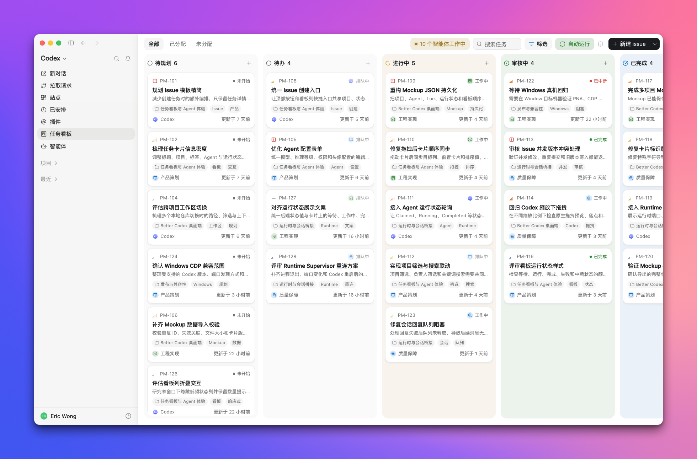
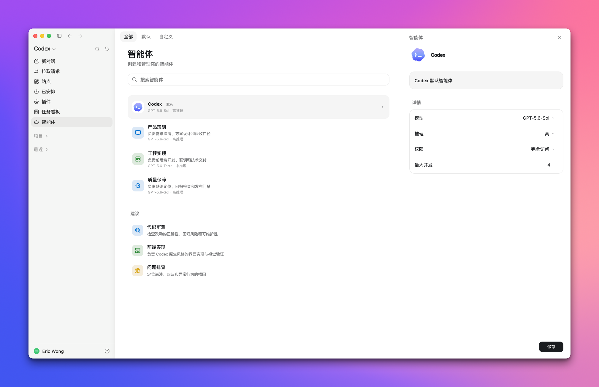

<p align="center">
  
</p>

<p align="center">
  <strong>从开始到完成，让 Codex 里的工作清晰可见。</strong>
</p>

<p align="center">
  运行在 Codex 客户端里的原生任务看板与多 Agent 协作系统。本地优先，一行命令安装。
</p>

<p align="center">
  <a href="https://github.com/Ericwong5021/better-codex/releases/latest"></a>
  <a href="https://github.com/Ericwong5021/better-codex/stargazers"></a>
  <a href="https://github.com/Ericwong5021/better-codex/releases"></a>
  <a href="https://github.com/Ericwong5021/better-codex/actions/workflows/ci.yml"></a>
  
  
</p>

<p align="center">
  <a href="README.md">English</a> · 简体中文
</p>

<p align="center">
  
</p>

## 为什么会有这个项目

如果你是 Codex 的重度用户，下面这些场景你多半不陌生：

- **会话列表杂乱难找。**<br>
  几十上百个对话堆在一起，标题大同小异，也没法按项目归类。想找回"上次调 auth 那个会话"，只能一边滚动一边靠猜。

- **所有会话共用一套模型配置。**<br>
  为了一个复杂重构调高推理等级，之后每个新会话都跟着买单；为了快速问答换了个轻量模型，下次深度排查开局就先天不足。全局只有这一个旋钮，所有任务都在抢它。

- **想法没有地方放。**<br>
  聊着聊着又想到三件值得做的事，但 Codex 没有任何地方能记下它们，最后要么丢进备忘录，要么写成 TODO 注释，要么干脆忘了。那些"本来打算做的事"就这么悄悄蒸发了。

- **Codex 长成了聊天的样子，但你的工作不是。**<br>
  真实的工作是一个跨越好几天、横跨好多会话的项目。Codex 只递给你一堆聊天记录，剩下的自求多福。

这些都不是模型的问题，模型很强。缺的是模型之上的那一层**工作系统**。所以我们动手做了一款更好的 Codex：Better Codex。

## 你会得到什么

**会话随时找得回来。**<br>
把对话收进任务，按项目、状态和负责人整理。再次打开任务，就能回到关联会话。

**想法先放进待办池。**<br>
聊天中冒出的新任务随手记下，之后继续推进。

**任务进度一眼可见。**<br>
任务可以交给自己或 Agent，手动运行或自动排队。需要审核、决策或解除阻塞时，它会回到你的看板。

**每个 Agent 单独配置。**<br>
模型、推理等级、权限、指令和并发上限都能按角色设置。

<p align="center">
  
</p>

## 谁适合用

Better Codex 适用于各种角色。只要你的工作会在 Codex 里持续多个会话，又需要跟踪进度、审核结果或反复修改，就可以放进同一套任务流程。

- **开发者。** 按项目管理需求、Bug、重构和发布检查。每个任务都能关联原始会话，进度、执行结果和待审核事项集中在看板里。
- **一人公司。** 把产品想法、用户反馈、运营事项和内容计划放在同一个看板里。调研、起草和检查可以交给不同的 Agent，关键决定仍由你完成。
- **自媒体工作者。** 用待规划区保存选题，再按调研、提纲、初稿和修改安排任务。每篇内容都能关联原始会话，隔几天回来也知道写到哪里。
- **产品经理。** 分开管理需求、用户反馈、竞品调研、Bug 和发布检查。讨论过程保留在关联会话里，看板负责显示下一步和当前负责人。
- **销售。** 整理公开的客户背景资料、拜访准备、方案草稿和跟进事项。可以按客户或机会建立项目，避免调研结果和待办散落在不同会话中。
- **办公室文员。** 管理会议纪要、通知草稿、报告整理、表格处理和周期性行政事项。把需要 Codex 协助的工作逐项交给 Agent，完成后集中检查。

## 用起来是什么样

1. 从 Codex 侧边栏打开 `任务看板` 管理任务，或打开 `智能体` 配置智能体。
2. 创建项目，手动添加任务，或者直接把当前对话收进任务。
3. 把任务分配给自己、默认 Codex 智能体或某个自定义智能体。
4. 想完全掌控就用手动运行；想持续推进就开自动运行。
5. 在看板上跟踪进度。任务需要审核或决定时，会回到你手上。
6. 打开任务查看关联会话、回复消息，或回到 Codex 继续工作。

同一套流程可以用于编程、调研、写作、文档整理，所有你已经在 Codex 里做的事。

## 安装方法

macOS：

```bash
curl -fsSL https://raw.githubusercontent.com/Ericwong5021/better-codex/main/scripts/install.sh | bash
```

Windows（PowerShell）：

```powershell
irm https://raw.githubusercontent.com/Ericwong5021/better-codex/main/scripts/install.ps1 | iex
```

Better Codex 以轻量 Node.js bundle 运行，需要 Node.js 22.5 或更新版本。安装脚本会先检查依赖，再修改现有安装。如果 Node.js 缺失或版本过低，脚本会询问是否安装当前 LTS 版本；选择不安装会直接终止，原有 Better Codex 和数据库都不会改变。

安装脚本会同时安装 CLI、Skill、本地运行时和系统启动入口，并在 Codex 中注册 `better-codex` MCP。MCP 只在本机运行，用来提供 Better Codex 应用入口和路由；项目、任务和会话数据仍保存在本地数据库中。旧版独立 EXE 只有在新 bundle 通过版本检查和健康检查后才会被移除。

从 Better Codex 启动入口重启 Codex，侧边栏会出现 `任务看板` 和 `智能体` 两个入口。完全卸载可运行 `better-codex uninstall`。

## 常见问题

**这是 OpenAI 官方产品吗？**<br>
不是。Better Codex 是一个独立的开源项目，基于 Codex Desktop 二次开发，与 OpenAI 没有隶属或背书关系。

**我的数据会去哪里？**<br>
默认不会离开本机。项目、任务、分配关系和运行状态保存在本地 SQLite 数据库（macOS 在 `~/.better-codex/better-codex.db`，Windows 在 `%USERPROFILE%\.better-codex\better-codex.db`），运行时只监听 `127.0.0.1`。只有在你主动连接自托管 Hub 后，Better Codex 才会把文档列明的看板投影上传到你的服务器；工作区路径、对话、Agent 指令、执行日志和凭据始终留在本机。Better Codex 不运营云端服务或账号系统。

**为什么需要注册 MCP？**<br>
Codex 通过本地 MCP 应用识别 Better Codex 的应用入口和路由，让任务看板可以进入 Codex 的导航流程，而不是覆盖在最后访问的会话页面上。MCP 通过本机 stdio 运行，不会上传任务数据；可选的 Hub 同步是独立功能，必须由你显式配置。

**可以远程访问任务看板吗？**<br>
可以。把可选的自托管 Hub 部署到 VPS，通过 Tailscale Serve 私有暴露，再运行 `better-codex sync connect` 连接本地运行时。数据边界、部署、备份和回滚步骤见[自托管 Hub 文档](docs/SELF_HOSTING.md)。

**它会搞坏我的 Codex 吗？**<br>
应用入口和路由通过本地 MCP 注册，页面集成使用桌面应用的本地 CDP 接口和页面结构，不修改 Codex 的二进制文件。Codex 更新后偶尔需要安装对应的兼容性更新，届时 Codex 内会出现提示。感觉哪里不对时，运行 `better-codex doctor` 检查。

**怎么关闭或卸载？**<br>
`better-codex eject` 只关闭页面集成，任务数据和安装组件会保留。`better-codex uninstall` 会删除 MCP、后台服务、启动入口、Skill、Agent 配置、本地数据和 CLI bundle。

**更新怎么做？**<br>
Better Codex 会在后台检查带签名的更新清单，发现新版本时在 Codex 内提示。你也可以随时重新运行安装命令，它会优先原地升级。

**如何加入或退出 Beta 通道？**<br>
先运行一次 `better-codex update --channel preview` 安装当前 Beta，再运行 `better-codex update channel preview` 持续接收 Preview 更新。运行 `better-codex update channel stable` 即可回到正式通道。两个通道共用本地配置和数据；切回正式通道时不会静默降级到更旧版本。

**支持哪些平台？**<br>
macOS 版 Codex Desktop（Apple Silicon 和 Intel），以及 Windows x64 上 Microsoft Store 版本的 Codex。Release 安装包和 CI 覆盖全部三个平台。

## 常用命令

```bash
better-codex doctor            # 检查 MCP、运行时、数据库、Codex 兼容性和注入状态
better-codex status            # 查看当前服务与看板连接
better-codex mcp status        # 检查 MCP 注册状态
better-codex mcp install       # 注册或修复 MCP
better-codex launcher install  # 安装系统启动入口
better-codex launcher status   # 检查系统启动入口
better-codex update channel preview  # 持续接收 Beta 更新
better-codex update channel stable   # 回到正式更新通道
better-codex eject             # 移除侧边栏集成，保留任务数据
better-codex uninstall         # 完全卸载并删除本地数据
```

## 从源码安装

需要 Node.js 22.5 或更新版本。

如果电脑上已经安装正式版，推荐把源码作为独立开发实例安装。正式版继续使用 `~/.better-codex` 和启动器 `Better Codex`；开发版使用 `~/.better-codex-dev` 和启动器 `Better Codex Dev`。两个实例默认共用正式版数据库 `~/.better-codex/better-codex.db`，运行时文件、日志、附件和更新状态仍彼此隔离。点击任一启动器时会先停用另一个实例的页面注入。

```bash
git clone https://github.com/Ericwong5021/better-codex.git
cd better-codex
npm ci
npm run dev:install
```

开发实例不会自动升级核心版本；拉取源码并执行 `npm run build` 即可刷新。使用 `npm run dev:status` 检查开发实例，使用 `npm run dev:uninstall` 移除开发版快捷方式并停止开发实例，开发数据会保留。

## 社区

- 发现 Bug 或想要新功能？提交 [GitHub Issue](https://github.com/Ericwong5021/better-codex/issues)。
- 使用问题和工作流想法欢迎到 [GitHub Discussions](https://github.com/Ericwong5021/better-codex/discussions) 交流。

如果 Better Codex 让你的 Codex 变得更好用，点个 Star 能帮更多重度用户找到它。
