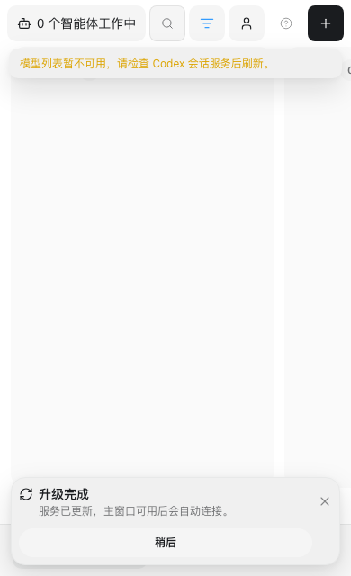
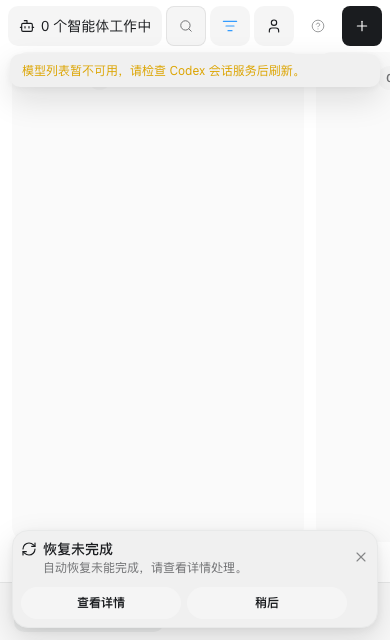

# 升级可靠性验收记录

日期：2026-09-12。环境：macOS arm64、Node 22.22.3、Chromium、Docker 29.4.0。开发分支为 `main`，业务数据库 schema 保持 25。

本次交付是修复提交、构建产物及隔离验收证据。未执行正式发布、本机安装替换或生产 VPS 部署。原有恢复提交 `1df99df` 和侧栏修复 `3a8ed19` 保留；事务/桌面阶段已提交为 `fc992b6`，安装器/VPS 阶段已提交为 `2da929f`。

## 检查结果

| 检查 | 结果 | 证据边界 |
| --- | --- | --- |
| `npm run verify` | 类型、生成文件、设计约束通过；后端 277 通过，11 跳过，0 失败；14.47 秒 | 跳过项均要求 Windows PowerShell 5.1 |
| `npm run test:web` | 14 通过；25.7 秒 | 包含本地 Web、远程 Relay Web、多窗口和重连 |
| 升级界面最终回归 | 4 通过；8.1 秒 | 最后一次提示调整后重跑升级用例 |
| `npm run test:deploy:selfhost` | 通过 | 隔离 Compose、Caddy HTTPS/WSS、密码会话、Runtime 权威和 Relay 无业务表 |
| `npm run build` | 通过 | 不更新已安装 Runtime 或注入 |
| `npm run package:binary` | 通过 | macOS arm64 Node bundle；隔离版本查询与 MCP 初始化/工具列表 |
| 新签名源码用例 | stable、preview 均通过，篡改 commit 后验签失败 | 使用临时测试密钥，不是正式签名发布 |

最后一轮自部署检查先遇到 Docker Hub 基础镜像元数据请求 EOF；保留失败日志后重跑通过。该错误发生在镜像构建前，不是健康检查通过，也没有生产容器被切换。

机器可读结果、实际进程身份和打包摘要见 [evidence.json](upgrade-reliability-2026-09-12/evidence.json)。本地详细日志保存在 `/tmp/better-codex-upgrade-verify-final.log`、`/tmp/better-codex-upgrade-web-final.log`、`/tmp/better-codex-upgrade-ui-final.log`、`/tmp/better-codex-upgrade-selfhost-final.log`、`/tmp/better-codex-upgrade-selfhost-registry-eof.log` 和 `/tmp/better-codex-upgrade-package-final.log`。

## 故障与连续性证据

| 场景 | 已验证结果 |
| --- | --- |
| 签名暂存、激活 | 目标 bundle 完成隔离启动预检；暂存时两个指针均未发布；修改签名后拒绝激活；原签名可激活固定核心与兼容包 |
| 无兼容包指针 | 保存原内置兼容包快照；终态核对完整指针对，错误指针对不能通过 |
| 激活器退出 | 只有一个恢复 owner；PID/启动时间记录保留；提交阶段不会被迟到超时转为回滚 |
| 连续恢复中断 | 达到恢复次数上限后进入 `recovery_failed`，后续检查不再启动激活器 |
| 部分指针切换、旧错误晚到 | 旧 WAL 恢复和新操作 fencing 用例通过；已提交 authority 拒绝重新开启回滚 |
| 两次连续会话交接 | 使用真实 Host/worker 进程及受控 App Server 协议夹具，generation 1 → 2 → 3，任务完成；Host、catalog、活动 worker 身份连续，结束后 worker 退出，待投递为 0 |
| 可重试投递 | 原 delivery ID 被重放；事务回执、重复投递与旧代次 fencing 用例通过 |
| 接收回执丢失 | CLI 和浏览器保留原请求键；再次提交内容相同，继续查询同一操作 |
| 刷新与两个窗口 | 两个窗口各自观察到恢复终态，不因另一个窗口清除共享缓存而停留在恢复中 |
| 过期桌面证据、辅助窗口 | Runtime 换代使旧证据失效；detached、听写、头像窗口被排除；损坏兼容包单独报告失败 |
| VPS 内部/公网目标检查失败 | 回滚使用保留的旧镜像和解析后的配置；回滚构建次数为 0；恢复检查通过才记录 restored |
| VPS 回滚检查失败 | 保留 `recovery_failed`，不误报 restored |
| VPS 回滚中断 | 复用原 transaction 和操作 ID；恢复过程不重新 fetch 或 build |
| VPS supervisor 被 SIGKILL | 存活部署子进程持有继承锁；新 supervisor 等待，之后恢复原操作，避免并行部署 |
| 磁盘、签名、安装边界 | 现有存储容量、签名/路径校验、安装超时和安装器提交后禁止第二次回退的用例通过 |

VPS 故障矩阵运行实际升级 Shell 函数，Git/Docker/curl 使用受控适配夹具；它验证事务、命令次序和终态，不代表真实公网故障演练。独立 Compose 验收使用真实容器与 Caddy。会话连续性使用协议夹具，不代表真实模型提供方完成了两次二进制升级。

运行时日志记录操作 ID、阶段耗时、原版本、目标版本、Runtime/Host 身份、失败代码和恢复次数。VPS 历史另保存 `stageDurations`、失败阶段及退出码。此次夹具的耗时用于复现定位，不作为生产升级耗时指标。

## 界面证据

升级完成但主窗口尚未出现，服务完成与桌面等待分别表达：

恢复未完成时提供详情入口，不显示“已恢复旧版”，不自动打开错误弹窗：

另见 [已确认恢复旧版](upgrade-reliability-2026-09-12/restored.png) 和 [核心成功、桌面连接需处理](upgrade-reliability-2026-09-12/desktop-action.png)。窄视口为 390 × 640，升级提示未越出视口。详细报告由用户打开后保留操作 ID。

## 正式发布前的剩余门禁

- Windows 原生安装、服务切换和桌面窗口行为；本机无法执行的 11 项检查仍须由 Windows CI 完成。
- 两次真实签名版本升级，包含真实活动任务、已安装 Codex 主窗口重载及正常/恢复流程的桌面观察。
- 真实 VPS 的镜像切换和公网失败演练。当前 Compose 验收不替代生产部署。
- 每个持久写入间隔的物理断电演练。本轮验证进程中断、事务夹具和文件同步约束，不宣称已验证所有硬件故障。

这些门禁沿用正常发布流程，不能用构建成功替代。
