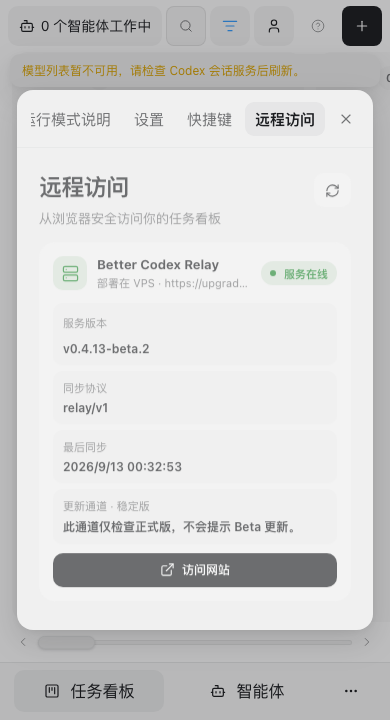
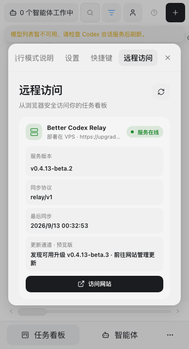

# VPS Beta update detection — 2026-09-13

The public Relay health response reported running version `0.4.13-beta.2`, channel `stable`, latest channel version `0.4.12`, status `current`, and automatic installation enabled. Its last successful check was `2026-09-12T15:46:32.195Z`. A stable-channel check excludes the published `0.4.13-beta.3` prerelease. The public endpoint does not establish whether the channel came from an explicit deployment setting or the Compose default.

The installer previously wrote only the domain and username to the deployment environment. Beta installations without an explicit channel therefore inherited Compose's stable default. The desktop/local Web remote-access renderer also ignored the Relay's cached update object and returned early when its authenticated upgrade button was hidden.

The installer now persists the selected version's channel when none is set, preserves existing channel and automatic-update preferences, and supports an explicit channel override. The upgrade transaction retains and restores the original environment with the retained images. Shared remote-access rendering displays channel and cached detection results independently of permission to submit an upgrade. A new available release takes precedence over an earlier operation's completed stage.

## Verification

- `npm run build` passed, including generated UI, design-token checks, and TypeScript compilation.
- `bash -n scripts/selfhost.sh` and `git diff --check` passed.
- `node --import tsx --test --test-force-exit test/dom.test.ts test/install-script.test.ts`: 91 passed, 10 Windows-specific skips, zero failures.
- Installer scenarios covered Beta/stable defaults, explicit stable selection on Beta, retained preview selection when installing stable, explicit override, and preservation of unrelated configuration and disabled automatic updates.
- The existing VPS fault harness verified environment and retained-image restoration after internal/public readiness failures, failed recovery, and interrupted rollback without rebuilding during recovery.
- `npx playwright test test/e2e/web/shared-regression.spec.ts -g 'remote access shows|upgrade'`: 5 passed. At 390 × 720, the local WebUI displayed the stable-channel explanation, then the preview update using a response containing an older completed operation stage. Text did not overflow and the website action remained in view. Existing receipt-loss, reload, and recovery scenarios passed.
- The generated UI before this correction lacked the update-channel element and failed the corresponding browser assertion. Final screenshots were visually inspected.

## Delivery boundary

This is source and isolated-test evidence. The installed desktop injection and production VPS were not replaced. The VPS still follows stable; subscribing that deployment to Beta requires saving `BETTER_CODEX_RELAY_UPDATE_CHANNEL=preview` and recreating Relay with its existing Compose configuration. Its enabled automatic updater can then install an available Beta. Publishing and production changes remain part of the separately authorized delivery flow.
