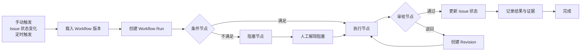

# Plan 4.3：图式工作流

## 目标

将 Better Codex 从“任务状态看板”扩展为可暂停、可审核、可恢复的本地工作流层。用户通过节点和连线定义任务如何流转，Runtime 负责按版本执行并记录证据。

本计划是未来能力，不代表当前版本已经支持工作流执行。

## 核心工作流

## 节点类型

首版只提供可验证、可恢复的有限节点，不开放任意脚本节点。

| 类型 | 作用 | 结果 |
| --- | --- | --- |
| Trigger | 手动、Issue 状态变化或定时启动 | 创建 Workflow Run |
| Condition | 判断状态、标签、优先级、依赖或字段 | 选择下一条边 |
| Action | 创建 Issue、更新字段、添加评论或调用已有 Codex Run | 产生领域事件 |
| Approval | 暂停并等待用户确认、退回或取消 | 继续、回退或结束 |
| Blocked | 等待缺失依赖、人工输入或故障恢复 | 解除后继续 |
| End | 标记成功、取消或失败 | 关闭 Workflow Run |

## 用户结果

- 在 Codex 面板或独立 Web UI 中创建、编辑和查看 Workflow 图。
- 通过节点连线表达正常路径、分支、回退和失败路径。
- 保存草稿，发布不可变版本；运行中的 Workflow 不受后续编辑影响。
- 从 Issue、Project 或命令面板手动启动 Workflow。
- 清楚看到当前节点、等待原因、输入、输出、错误和下一步动作。
- 在审核节点暂停，用户确认后继续，退回后回到指定节点。
- Runtime 重启后能够恢复未完成 Run，不重复执行已确认的动作。
- 关闭 Workflow 后，基础 Issue、Thread 和手动处理流程仍然可用。

## 编辑器交互

- 画布显示节点、连线、状态、运行数量和错误标记。
- 左侧节点面板只显示当前版本支持的节点类型。
- 右侧属性面板编辑节点输入、条件和失败策略。
- 连线时校验入口、出口、循环和必填字段。
- 提供预览路径，展示给定 Issue 输入下会经过的节点。
- 运行详情可从节点反查 Issue、Thread、Run Event 和交付结果。
- 只在用户明确点击发布后生成新版本；草稿不参与自动触发。

## Runtime 执行规则

- Workflow 定义、版本、Run 和 Node Run 都由 Runtime 统一管理。
- 每个 Run 绑定 `workflow_version_id`、触发来源和 Issue，不能跨版本漂移。
- 节点完成、状态变化和证据事件在同一事务中提交。
- Action 必须有幂等键，Runtime 重启或重试时不得重复创建领域对象。
- 失败策略固定支持 `retry`、`blocked`、`cancel`，首版不自动跳过失败节点。
- Approval 和 Blocked 是持久化等待状态，不依赖前端页面保持打开。
- 删除或停用 Workflow 不删除历史定义、Run、Node Run 和证据。
- 并发限制复用现有 Runtime、Issue 和 Codex Run 的租约规则。

## 数据模型

### `workflows`

- `id`
- `project_id`
- `name`
- `description`
- `status`
- `published_version_id`
- `created_at`
- `updated_at`

### `workflow_versions`

- `id`
- `workflow_id`
- `version`
- `definition_json`
- `created_by`
- `published_at`
- `created_at`

已发布版本不可变，`definition_json` 保存节点、连线、参数和失败策略。

### `workflow_runs`

- `id`
- `workflow_version_id`
- `issue_id`
- `trigger_type`
- `status`
- `current_node_id`
- `idempotency_key`
- `started_at`
- `paused_at`
- `finished_at`
- `error_code`

### `workflow_node_runs`

- `id`
- `workflow_run_id`
- `node_id`
- `status`
- `attempt`
- `input_json`
- `output_json`
- `error_json`
- `started_at`
- `finished_at`

## 实现顺序

1. 定义 Workflow、版本和节点 JSON Schema，提供只读解析与画布展示。
2. 实现草稿保存、图校验、版本发布和手动预览。
3. 接入 Issue 状态、标签和字段条件，以及 Action 领域事件。
4. 接入已有 Codex Run，支持执行、暂停、失败、重试和恢复。
5. 加入 Approval、Blocked、Revision 和证据时间线。
6. 增加定时触发、幂等保护、并发限制和 Runtime 重启恢复。
7. 在 Codex 面板和 Web UI 中复用同一套画布、详情和运行状态组件。

## 本计划不包含

- 云端工作流、远程队列、团队共享和账号权限。
- 任意自然语言评论自动触发工作流。
- 首版任意 JavaScript、Shell 或网络请求节点。
- 以工作流编辑器替代 Issue、Thread 和 Review 的基础模型。
- 将图上的节点数量当作产品完成度；完成标准是可观察、可恢复和可人工接管。

## 阶段门槛

- 可以创建图、保存草稿、校验错误并发布不可变版本。
- 给定一个 Issue，可以从触发到完成看到完整节点路径和证据。
- 审核、阻塞、退回、重试和取消都有明确状态及人工入口。
- Runtime 重启、前端刷新和重复触发不会造成重复 Action。
- Workflow 失败时，用户仍可直接操作 Issue、Thread 和已有 Run。
- macOS 与 Windows 使用同一工作流定义；平台差异只在已有 Codex、Runtime 和安装能力中单独诊断。
